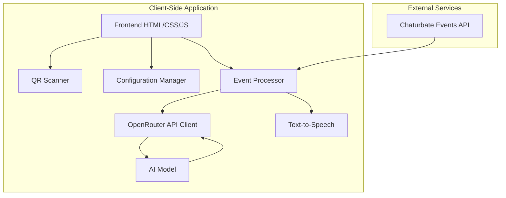
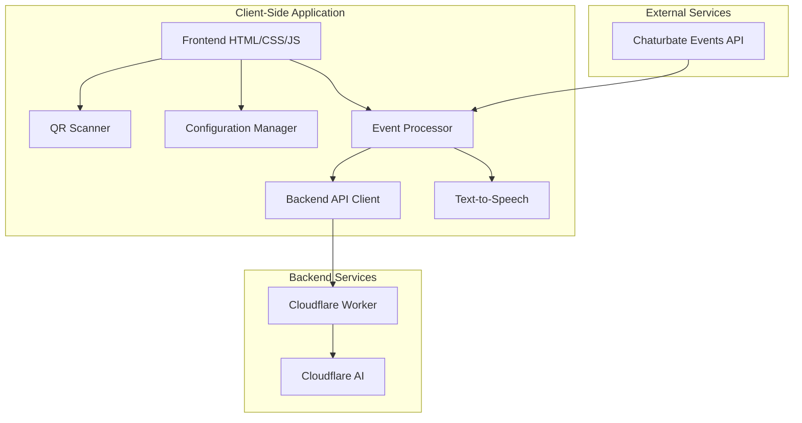

# Architecture Overview

This document provides an overview of the CB Broadcasting Real-Time Coach application architecture.

## Current Architecture

The application currently follows a client-side only architecture with no backend server. All processing happens in the browser, with external API calls made directly from the client.

### Components

1. **Frontend Interface**: HTML, CSS, and JavaScript that provide the user interface.
2. **QR Scanner**: Allows users to scan the Chaturbate Events API QR code to connect to their stream.
3. **Configuration Manager**: Handles user settings and preferences.
4. **Event Processor**: Processes events from the Chaturbate Events API and maintains context for AI prompts.
5. **OpenRouter API Client**: Communicates with the OpenRouter API to generate coaching prompts.
6. **Text-to-Speech**: Converts generated prompts to audio for the broadcaster.

### Data Flow

1. User scans the Chaturbate Events API QR code using the application.
2. The application connects to the Chaturbate Events API and begins receiving events.
3. Events are processed and displayed in the activity feed.
4. Periodically, the application sends recent context to the OpenRouter API to generate coaching prompts.
5. Generated prompts are displayed in the prompt feed and spoken using text-to-speech.

### Dependencies

- **Chaturbate Events API**: Provides real-time events from the broadcaster's stream.
- **OpenRouter API**: Provides access to various AI models for generating coaching prompts.
- **jsQR**: Library for QR code scanning.
- **Web Speech API**: Browser API for text-to-speech functionality.

## Planned Architecture

The planned architecture involves adding a backend using Cloudflare Worker AI to eliminate the need for users to provide their own OpenRouter API key.

### Planned Changes

1. **Backend API**: A new backend API using Cloudflare Workers will be created to handle AI requests.
2. **Cloudflare AI Integration**: The backend will use Cloudflare AI to generate coaching prompts.
3. **Simplified Configuration**: Users will no longer need to provide their own OpenRouter API key.
4. **Enhanced Security**: API keys will be stored securely on the server side rather than in the client.

See the [Backend Documentation](backend.md) for more details on the planned backend implementation.
