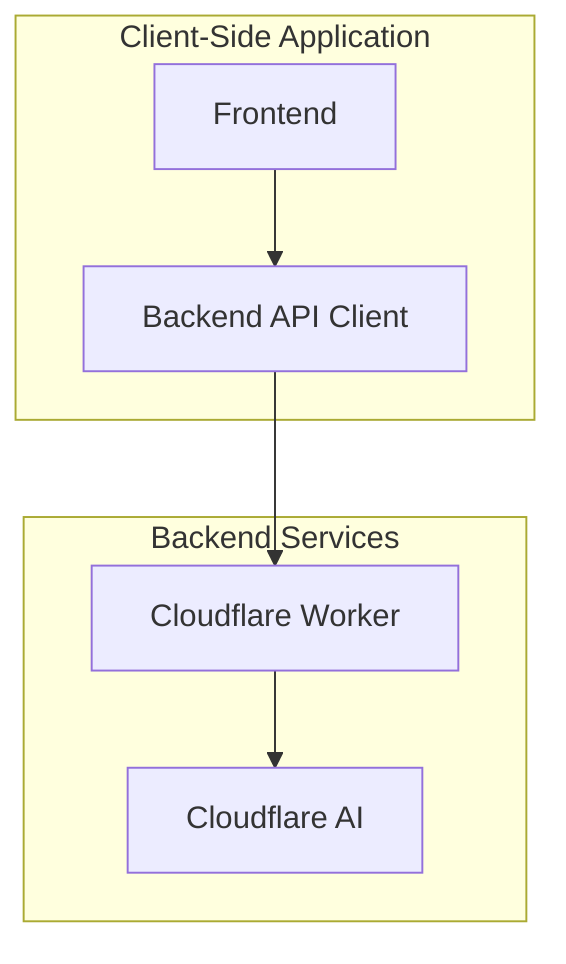

# Backend Documentation

This document provides information about the planned backend implementation for the CB Broadcasting Real-Time Coach application.

## Current Status

Currently, the application does not have a backend server. All processing happens in the browser, with external API calls made directly from the client to the OpenRouter API. This requires users to:

1. Create an account on OpenRouter
2. Generate their own API key
3. Enter the API key in the application settings
4. Pay for their own API usage

## Planned Backend Implementation

The planned backend will use Cloudflare Workers and Cloudflare AI to eliminate the need for users to provide their own OpenRouter API key.

### Architecture



### Technologies

- **Cloudflare Workers**: Serverless functions that run on Cloudflare's edge network
- **Cloudflare AI**: AI models hosted on Cloudflare's infrastructure
- **Wrangler**: CLI tool for developing, testing, and deploying Cloudflare Workers

### Implementation Plan

1. **Create a Cloudflare Worker**: Develop a serverless function that will handle requests from the frontend
2. **Integrate with Cloudflare AI**: Use Cloudflare's AI models to generate coaching prompts
3. **Implement Authentication**: Add basic authentication to prevent abuse
4. **Update Frontend**: Modify the frontend to use the new backend API instead of OpenRouter

### API Endpoints

The backend will provide the following API endpoint:

#### Generate Coaching Prompt

```
POST /api/generate-prompt
```

Request body:
```json
{
  "context": [
    {
      "text": "User123: Hello everyone!",
      "type": "chat",
      "timestamp": "2025-03-13T03:15:45.000Z"
    },
    {
      "text": "User456 tipped 50 tokens",
      "type": "tip",
      "timestamp": "2025-03-13T03:16:12.000Z"
    }
  ],
  "broadcaster": "BroadcasterName",
  "preferences": "Optional preferences or restrictions",
  "aimodel": "@cf/meta/llama-3.3-70b-instruct-fp8-fast"
}
```

Response body:
```json
{
  "prompt": "Thank User456 for the generous tip and ask what brought them to your stream today.",
  "model": "Cloudflare AI @cf/meta/llama-3-70b-instruct"
}
```

### Benefits

1. **Simplified User Experience**: Users will no longer need to create an OpenRouter account or manage API keys
2. **Cost Control**: The application operator can manage and monitor API usage
3. **Performance**: Cloudflare's edge network provides low-latency responses worldwide
4. **Reliability**: Cloudflare's infrastructure is highly available and scalable

### Development Steps

1. **Setup Cloudflare Account**: Create a Cloudflare account and enable Cloudflare Workers and Cloudflare AI
2. **Initialize Worker Project**: Use Wrangler to create a new Worker project
3. **Implement API Endpoint**: Create the endpoint for generating coaching prompts
4. **Test Locally**: Use Wrangler to test the Worker locally
5. **Deploy to Cloudflare**: Deploy the Worker to Cloudflare's network
6. **Update Frontend**: Modify the frontend to use the new backend API

### Code Structure

The backend code will be organized as follows:

```
backend/
├── wrangler.toml       # Cloudflare Workers configuration
├── package.json        # Node.js package configuration
└── src/
    ├── index.js        # Main Worker entry point
    ├── ai.js           # Cloudflare AI integration
    └── middleware/
        └── auth.js     # Authentication middleware
```

### Security Considerations

1. **Rate Limiting**: Implement rate limiting to prevent abuse
2. **Authentication**: Add basic authentication to ensure only legitimate users can access the API
3. **Content Filtering**: Implement content filtering to prevent inappropriate prompts
4. **Error Handling**: Provide graceful error handling without exposing internal details

## Migration Plan

1. **Develop Backend**: Create the Cloudflare Worker backend
2. **Test in Parallel**: Run the new backend alongside the existing OpenRouter integration
3. **Update Frontend**: Modify the frontend to support both backends during transition
4. **Gradual Rollout**: Gradually move users to the new backend
5. **Deprecate OpenRouter**: Eventually remove the OpenRouter integration

The migration will be done in a way that minimizes disruption to existing users while providing a path to the improved backend.
